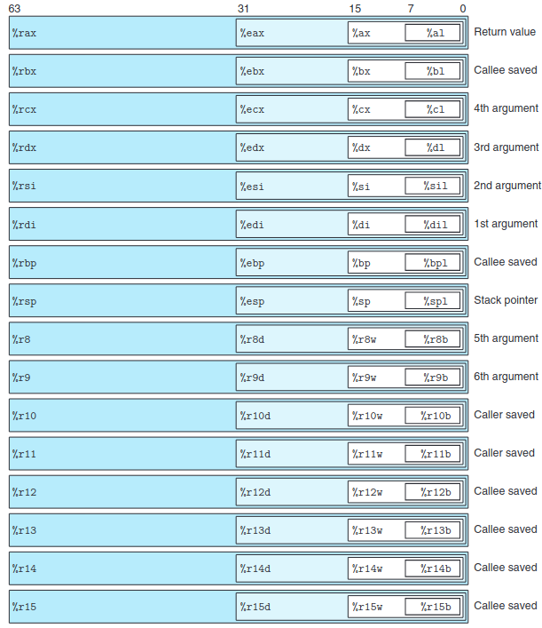

# Register and Stack

## Author: Frankie Huang (IF 2021)

## Prerequisite

- GNU C compiler (gcc)
- GNU debugger (gdb)
- UNIX like operating system to run the ELF file

## What is a register?

Simply put, a register is a location within a processor (a CPU core) that is able to store data, much like a memory. The main difference between a register and a memory are registers can only store a tiny amount of data compared to a memory. However, registers have it's own advantage as the time needed to access a register is effectively instantaneous.

Registers can hold any value: addresses (pointers), results from mathematical operations, characters, etc. There are [seven kinds of registers](https://www.geeksforgeeks.org/different-classes-of-cpu-registers/), two of which are:

- General Purpose Registers (GPRs)

Registers that are used to hold any values and computing mathematical operations

- Special Purpose Registers (SPRs)

Registers that have a special purpose and are not used for storing values and computing mathematical operations

On x86, there are only two kinds of SPR, `%rip` which stores the address of the next instruction to execute and `%rsp` the address of the top of the stack.

## Accessing a register

On x86, there are 15 general purpose registers and 2 special purpose registers.



We can see from the image above that a same register can be accessed in many different ways. For example, we can use `%rax` to access the full 64-bit register, `%eax` to access the low 32-bits, `%ax` to access the high 16-bits, `%ah` to access the high 8-bits (the bits 8-15), and `%al` to access the low 8-bits.

## Calling Conventions

When we want to call a function with arguments, we need a way to store the arguments passed into the function. In linux binaries, there are only two commonly used calling conventions:

1. cdecl (used for 32-bit binaries)

In 32-bit binaries on linux, function arguments are passed in on the stack in reverse order. For example, the function below

```c
int foo(int a, int b, int c)
{
    return a + b - c;
}
```

would be invoked by pushing `c`, then `b`, and then `a`.

2. SysV (used for 64-bit)

For 64-bit binaries, function arguments are first passed in certain registers

1. `%rdi`
2. `%rsi`
3. `%rdx`
4. `%rcx`
5. `%r8`
6. `%r9`

Then any leftover arguments are pushed onto the stack in reverse order, as in cdecl.

## The Stack

The stack is a hardware manifestation of the stack data structure (Last In First Out) in a chosen area in the memory. The `%esp`/`%rsp` register holds the address in memory where the bottom of the stack resides. When something is `push`-ed to the stack, the value of `%esp` decrements by 4 (or 8 on 64-bit x86), and the value that was `push`-ed is stored at that location in memory. Likewise, when a `pop` instruction is executed, the value at `%rsp` is retrieved and the value of `%esp` increments by 4 (or 8).

Conventionally, `%ebp` holds the address of the top of the **current** stack frame (the space used on the stack by a given function), so local variables are referenced as an offest relative to `%ebp` rather than `%esp`.

The stack is primarily used for a few things:

- Storing function arguments
- Storing local variables
- Storing processor state between function calls

## Stack In Action

Let's observe the condition of the stack when the following program is run:

```c
#include <stdio.h>

int foo(int x)
{
    if (x == 1)
    {
        return 2;
    }
    else
    {
        x--;
        return 2 * foo(x);
    }
}

int main()
{
    int a = 11;
    int b = 711;
    int c = foo(a) - b;

    printf("%d\n", c);
}
```

We can save the program above as `foo.c` and run the command below.

```sh
> gcc foo.c -o foo -m32 -O1
> objdump -d foo > out.txt
> ./test
1337
>
```

Opening the file out.txt, we will get the relevant assembly:

```md
5655618d <foo>:
0x56556189: 55 push %ebp
0x5655618a: 89 e5 mov %esp, %ebp
0x5655618c: 83 ec 0c sub $0xc,%esp
0x5655618f: 8b 54 24 10 mov 0x10(%esp),%edx
0x56556193: b8 02 00 00 00 mov $0x2,%eax
0x56556198: 83 fa 01 cmp $0x1,%edx
0x5655619b: 74 11 je 61ae <foo+0x22>
0x5655619d: 83 ec 0c sub $0xc,%esp
0x565561a0: 83 ea 01 sub $0x1,%edx
0x565561a3: 52 push %edx
0x565561a4: e8 e3 ff ff ff call 6189 <foo>
0x565561a9: 83 c4 10 add $0x10,%esp
0x565561ac: 01 c0 add %eax,%eax
0x565561ae: 83 c4 0c add $0xc,%esp
0x565561b1: c9 leave
0x565561b2: c3 ret

565561b3 <main>:
0x565561b3: 8d 4c 24 04 lea 0x4(%esp),%ecx
0x565561b7: 83 e4 f0 and $0xfffffff0,%esp
0x565561ba: ff 71 fc push -0x4(%ecx)
0x565561bd: 55 push %ebp
0x565561be: 89 e5 mov %esp,%ebp
0x565561c0: 53 push %ebx
0x565561c1: 51 push %ecx
0x565561c2: e8 c9 fe ff ff call 1090 <\_\_x86.get_pc_thunk.bx>
0x565561c7: 81 c3 2d 2e 00 00 add $0x2e2d,%ebx
0x565561cd: 83 ec 0c sub $0xc,%esp
0x565561d0: 6a 0b push $0xb
0x565561d2: e8 b6 ff ff ff call 6189 <foo>
0x565561d7: 83 c4 08 add $0x8,%esp
0x565561da: 2d c7 02 00 00 sub $0x2c7,%eax
0x565561df: 50 push %eax
0x565561e0: 8d 83 14 e0 ff ff lea -0x1fec(%ebx),%eax
0x565561e6: 50 push %eax
0x565561e7: e8 64 fe ff ff call 1050 <printf@plt>
0x565561ec: 83 c4 10 add $0x10,%esp
0x565561ef: b8 00 00 00 00 mov $0x0,%eax
0x565561f4: 8d 65 f8 lea -0x8(%ebp),%esp
0x565561f7: 59 pop %ecx
0x565561f8: 5b pop %ebx
0x565561f9: 5d pop %ebp
0x565561fa: 8d 61 fc lea -0x4(%ecx),%esp
0x565561fd: c3 ret
```

Skipping over the function `main`, we can see that at `0x565561d0` we push the value `0xb` (or 11 in hexadecimal) into the stack. Then, a call instruction is executed at `0x565561d2` and `%eip` jumps to the destination (i.e. `0x56556189`). So just before the processor begins executing `foo` at `0x56556189` the stack looks like this:

```md
eip = 0x56556189 // push %ebp
esp = 0xffffd8ec
ebp = 0xffff002c // main top stack frame address

            0xffffd8f0 : 0xb                // foo(11) first argument
     esp -> 0xffffd8ec : 0x565561d7         // Return address for foo(11)
```

The first thing `foo` does is save the current ebp so that when it returns, `ebp` is back where `main` expects it to be. The stack now looks like this:

```md
eip = 0x5655618a // mov %esp, %ebp
esp = 0xffffd8e8
ebp = 0xffff002c // main top stack frame address

            0xffffd8f0 : 0xb                // foo(11) first argument
            0xffffd8ec : 0x565561d7         // Return address for foo(11)
     esp -> 0xffffd8e8 : 0xffff002c         // Saved main EBP
```

Note how `esp` gets smaller when values are pushed to the stack.

Next, the current `esp` is saved into `ebp`, marking the top of the new stack frame.

```md
eip = 0x5655618c // sub $0xc,%esp
esp = 0xffffd8e8
ebp = 0xffffd8e8 // main top stack frame address

            0xffffd8f0 : 0xb                // foo(11) first argument
            0xffffd8ec : 0x565561d7         // Return address for foo(11)

esp,ebp -> 0xffffd8e8 : 0xffff002c // Saved main EBP
```

Then the stack is grown to accomodate local variables in `foo`.

```md
eip = 0x5655618f // mov 0x10(%esp),%edx
esp = 0xffffd8dc
ebp = 0xffffd8e8 // main top stack frame address

            0xffffd8f0 : 0xb                // foo(11) first argument
            0xffffd8ec : 0x565561d7         // Return address for foo(11)
     ebp -> 0xffffd8e8 : 0xffff002c         // Saved main EBP
            0xffffd8e4
            0xffffd8e0
     esp -> 0xffffd8dc
```

Skipping over the calculation part of `foo`, we can see that because `x != 1` yet, we do not jump to `0x565561ae`, so we go to `0x565561a3` and push the value `edx` before calling the function `foo(x)` again, with the x value of `10`. Now, let's look at the condition of the stack after the setup stage of `foo(10)` has finished:

```md
eip = 0x5655618f // mov 0x10(%esp),%edx
esp = 0xffffd8b8
ebp = 0xffffd8c4 // main top stack frame address

eax = 0x2 // 2

            0xffffd8f0 : 0xb                // foo(11) first argument
            0xffffd8ec : 0x565561d7         // Return address for foo(11)
            0xffffd8e8 : 0xffff002c         // Saved main EBP
            0xffffd8e4
            0xffffd8e0
            0xffffd8dc
            0xffffd8d8
            0xffffd8d4
            0xffffd8d0
            0xffffd8cc : 0xa                // foo(10) first argument
            0xffffd8c8 : 0x565561a9         // Return address for foo(10)
     ebp -> 0xffffd8c4 : 0xffffd8e8         // Saved foo(10) EBP
            0xffffd8c0
            0xffffd8bc
     esp -> 0xffffd8b8
```

We can see that because the function `foo` is recursive, the stack will keep on growing until `foo` is no longer called, i.e. when `x` is equal to `1`. Let's look at the condition of the stack after the setup stage of `foo(1)` has finished:

```md
eip = 0x5655618f // mov 0x10(%esp),%edx
esp = 0xffffd79c
ebp = 0xffffd790 // main top stack frame address

eax = 0x2 // 2

            0xffffd8f0 : 0xb                // foo(11) first argument
            0xffffd8ec : 0x565561d7         // Return address for foo(11)
            0xffffd8e8 : 0xffff002c         // Saved main EBP
                     .....
            0xffffd798 : 0x1                // foo(1) first argument
            0xffffd794 : 0x565561a9         // Return address for foo(1)
     ebp -> 0xffffd790 : 0xffffd7b4         // Saved foo(2) EBP
            0xffffd7a4
            0xffffd7a0
     esp -> 0xffffd79c
```

Now, instead of calling `foo(0)`, we jump straight to `0x565561ae`, popping the unused `esp` (in the assembly, this is shown by the instruction `add`).

```md
eip = 0x565561b1 // leave
esp = 0xffffd790
ebp = 0xffffd790 // main top stack frame address

eax = 0x2 // 2

            0xffffd8f0 : 0xb                // foo(11) first argument
            0xffffd8ec : 0x565561d7         // Return address for foo(11)
            0xffffd8e8 : 0xffff002c         // Saved main EBP
                     .....
            0xffffd798 : 0x1                // foo(1) first argument
            0xffffd794 : 0x565561a9         // Return address for foo(1)

esp,ebp -> 0xffffd790 : 0xffffd7b4 // Saved foo(2) EBP
```

Then, the `leave` instruction moves `ebp` into `esp` and pops the saved `ebp`.

```md
eip = 0x565561b2 // ret
esp = 0xffffd794
ebp = 0xffffd7b4 // main top stack frame address

eax = 0x2 // 2

            0xffffd8f0 : 0xb                // foo(11) first argument
            0xffffd8ec : 0x565561d7         // Return address for foo(11)
            0xffffd8e8 : 0xffff002c         // Saved main EBP
                     .....
     ebp -> 0xffffd7b4 : 0xffffd7e8         // Saved foo(3) EBP
                     .....
            0xffffd798 : 0x1                // foo(1) first argument
     esp -> 0xffffd794 : 0x565561a9         // Return address for foo(1)
```

Then, the instruction `ret` pops the return address for `foo(2)` into `eip` which causes the program to return to `foo(2)` with the same `esp`, `ebp`, and stack contents as when `foo(1)` was initially called.

```md
eip = 0x565561a9 // add $0x10,%esp
esp = 0xffffd798
ebp = 0xffffd7b4 // main top stack frame address

eax = 0x2 // 2

            0xffffd8f0 : 0xb                // foo(11) first argument
            0xffffd8ec : 0x565561d7         // Return address for foo(11)
            0xffffd8e8 : 0xffff002c         // Saved main EBP
                     .....
            0xffffd7bc : 0x2                // foo(2) first argument
            0xffffd7b8 : 0x565561a9         // Return address for foo(2)
     ebp -> 0xffffd7b4 : 0xffffd7e8         // Saved foo(3) EBP
            0xffffd7b0
            0xffffd7ac
            0xffffd7a8
            0xffffd7a4
            0xffffd7a0
            0xffffd79c
     esp -> 0xffffd798 : 0x1                // foo(1) first argument
```

Continuing from `0x565561a9`, we pop 16 bytes of data from the stack, at `0x565561ac` we double the value of `eax` by adding it to itself, then at `0x565561ae` we pop 12 bytes of data from the stack.

```md
eip = 0x565561a9 // add $0x10,%esp
esp = 0xffffd798
ebp = 0xffffd7b4 // main top stack frame address

eax = 0x4 // 4

            0xffffd8f0 : 0xb                // foo(11) first argument
            0xffffd8ec : 0x565561d7         // Return address for foo(11)
            0xffffd8e8 : 0xffff002c         // Saved main EBP
                     .....
            0xffffd7bc : 0x2                // foo(2) first argument
            0xffffd7b8 : 0x565561a9         // Return address for foo(2)

esp,ebp -> 0xffffd7b4 : 0xffffd7e8 // Saved foo(3) EBP
```

Again, because `foo(2)` will return to `foo(3)` and `foo(3)` will return to `foo(4)`, we continuously pop 16 bytes at `0x565561a9`, double the value of `eax` at `0x565561ac`, pop 12 bytes at `0x565561ae`, then run the `leave` then `ret` instruction until we're back at `foo(11)`. Let's see the condition of the stack after `foo(10)` has returned.

```md
eip = 0x565561a9 // add $0x10,%esp
esp = 0xffffd8cc
ebp = 0xffffd8e8 // main top stack frame address

eax = 0x400 // 1024

            0xffffd8f0 : 0xb                // foo(11) first argument
            0xffffd8ec : 0x565561d7         // Return address for foo(11)
     ebp -> 0xffffd8e8 : 0xffff002c         // Saved main EBP
            0xffffd8e4
            0xffffd8e0
            0xffffd8dc
            0xffffd8d8
            0xffffd8d4
            0xffffd8d0
     esp -> 0xffffd8cc: 0xa                 // foo(10) first argument
```

We pop 16 bytes of data from the stack.

```md
eip = 0x565561ac // add %eax,%eax
esp = 0xffffd8dc
ebp = 0xffffd8e8 // main top stack frame address

eax = 0x400 // 1024

            0xffffd8f0 : 0xb                // foo(11) first argument
            0xffffd8ec : 0x565561d7         // Return address for foo(11)
     ebp -> 0xffffd8e8 : 0xffff002c         // Saved main EBP
            0xffffd8e4
            0xffffd8e0
     esp -> 0xffffd8dc
```

We add `eax` onto itself.

```md
eip = 0x565561ae // add $0xc,%esp
esp = 0xffffd8dc
ebp = 0xffffd8e8 // main top stack frame address

eax = 0x800 // 2048

            0xffffd8f0 : 0xb                // foo(11) first argument
            0xffffd8ec : 0x565561d7         // Return address for foo(11)
     ebp -> 0xffffd8e8 : 0xffff002c         // Saved main EBP
            0xffffd8e4
            0xffffd8e0
     esp -> 0xffffd8dc
```

Then, we pop 12 bytes of data from the stack again.

```md
eip = 0x565561b1 // leave
esp = 0xffffd8e8
ebp = 0xffffd8e8 // main top stack frame address

eax = 0x800 // 2048

            0xffffd8f0 : 0xb                // foo(11) first argument
            0xffffd8ec : 0x565561d7         // Return address for foo(11)

esp,ebp -> 0xffffd8e8 : 0xffff002c // Saved main EBP
```

The instruction `leave` is ran.

```md
eip = 0x565561b2 // ret
esp = 0xffffd8ec
ebp = 0xffff002c // main top stack frame address

eax = 0x800 // 2048

            0xffffd8f0 : 0xb                // foo(11) first argument
     esp -> 0xffffd8ec : 0x565561d7         // Return address for foo(11)
```

And lastly, the instruction `ret` is ran.

```md
eip = 0x565561d7 // add $0x8,%esp
esp = 0xffffd8ec
ebp = 0xffff002c // main top stack frame address

eax = 0x800 // 2048

     esp -> 0xffffd8f0 : 0xb                // foo(11) first argument
```

At the `main` function, the program will print the value at `0x565561e7` and return at `0x565561fd`.
